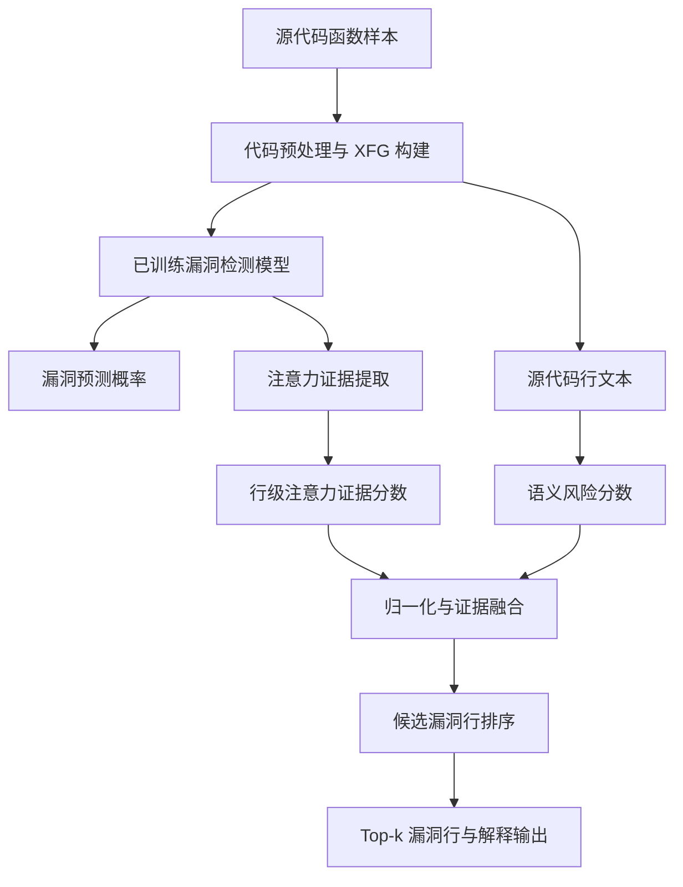
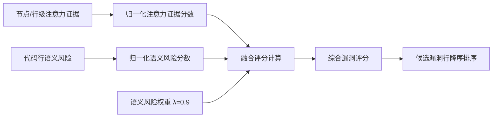

# 第3章 方法设计

本章介绍面向源代码漏洞检测的注意力证据与语义风险融合细粒度定位方法。本文方法不重新训练漏洞检测模型，也不改变原有模型结构，而是在已有模型完成函数级或图级漏洞预测之后，对代码行进行证据提取、语义风险评估和综合评分，从而输出候选漏洞行排序结果与解释信息。

## 3.1 总体框架

本文方法的总体框架如图1所示。给定源代码函数样本，首先通过代码预处理和图结构构建得到 XFG 样本，并输入已训练漏洞检测模型，得到样本漏洞预测概率。随后，从模型前向传播过程中提取节点级或语句级注意力证据，并依据节点与源代码行号之间的映射关系聚合为行级注意力证据分数。与此同时，方法根据代码行文本计算语义风险分数，用于刻画危险 API、内存操作、外部输入、数组指针访问和边界相关操作等安全语义风险。最后，将两类分数归一化后进行线性融合，得到每个候选代码行的综合漏洞评分，并按照分数降序输出 Top-k 候选漏洞行。



**图1 本文方法总体框架图**

图1说明：本文方法以已有漏洞检测模型为基础，在推理阶段提取注意力证据并计算语义风险分数。A+S 融合分数作为候选漏洞行主排序依据，输出 Top-k 漏洞行及解释信息。

与端到端重新训练的行级检测模型不同，本文方法强调对已有漏洞检测结果的解释和细粒度定位增强。模型漏洞预测概率用于判断样本整体风险，综合漏洞评分则用于回答“哪些代码行更可能与漏洞相关”。因此，本文方法既保留原模型的检测能力，又补充面向人工审计的行级解释结果。

## 3.2 代码表示与预处理

本文实验中的样本以函数级代码片段为基本单位。对于每个函数样本，首先进行词法分割和规范化处理，将源代码转换为 token 序列，并保留 token 与源代码行号之间的对应关系。对于长度不一致的节点 token 序列，采用截断和填充方式形成统一输入长度，以满足神经网络批处理要求。对于图结构样本，进一步根据程序依赖关系构建 XFG，其中节点表示语句或代码片段，边表示控制依赖、数据依赖或执行路径相关关系。

在 SARD 数据集中，测试样本以 XFG 文件形式组织。行级标签采用 `xfg_stem` 策略构建，即从 XFG 文件名中提取真实漏洞行号。例如，文件名 `116.xfg.pkl` 对应 `true_vul_lines=[116]`。负样本不生成漏洞行标签，仅正样本参与 Top-k、MRR 和 IFA 定位评估。在 DiverseVul-subset 中，行级标签由漏洞修复提交的补丁差异近似构造，将被删除或被修改的代码行映射回漏洞函数内部。该设置与第4章实验保持一致。

预处理阶段的目标并不是改变已有模型输入形式，而是确保后续能够完成三类映射：第一，模型输入节点到源代码行的映射；第二，源代码行到文本内容的映射；第三，候选代码行到真实漏洞行标签的映射。只有同时具备上述信息，才能在模型预测之后计算行级定位指标并生成解释输出。

## 3.3 注意力证据分数计算

注意力证据分数用于描述模型在判断样本为漏洞时对不同代码节点或语句的关注程度。设输入样本对应的 XFG 为 $G=(V,E)$，其中 $V$ 表示节点集合，$E$ 表示边集合。已训练漏洞检测模型记为 $f(\cdot)$，其输出样本漏洞概率如式（1）所示。

```math
P_{\mathrm{vul}} = f(G)
```

式（1）表示漏洞检测模型对函数图 $G$ 的漏洞概率预测结果。对于节点 $v_i\in V$，若模型内部提供节点注意力权重、节点门控权重或其他节点级证据变量，则直接将其作为节点注意力证据分数 $A(v_i)$。若模型没有显式暴露注意力权重，则可使用节点表示范数等方式构造最小可运行的节点重要性估计。本文实验中的 Attention-only 基线即仅使用该类模型内部证据进行排序。

由于最终定位对象是源代码行，需要将节点级证据聚合为行级分数。设 $L_j$ 表示第 $j$ 行源代码，$V(L_j)$ 表示映射到该行的节点集合，则行级注意力证据分数如式（2）所示。

```math
A(L_j)=\max_{v_i\in V(L_j)} A(v_i)
```

式（2）表示将节点级注意力证据聚合为行级注意力证据分数。本文采用最大池化而非平均池化，是因为漏洞行通常由其中最关键的危险节点决定。如果同一行包含多个节点，平均池化可能削弱关键节点贡献，而最大池化能够保留最强证据。随后，对一个样本内所有候选行的注意力证据分数进行 min-max 归一化，得到 $\hat{A}(v_i)$，用于后续融合。

## 3.4 语义风险分数建模

注意力证据来自模型内部，能够反映模型对当前样本的关注区域，但其排序结果可能受到上下文噪声影响。为增强对漏洞相关语义的敏感性，本文构建语义风险分数 $R(v_i)$。该分数并非简单判断代码行是否包含某个危险函数，而是从安全审计角度对不同风险模式赋予差异化权重，使高风险语义能够参与候选行排序。

语义风险建模主要考虑六类因素。第一，危险拷贝或字符串 API，如 `strcpy`、`strcat`、`sprintf`、`vsprintf`、`gets`、`memcpy`、`memmove`、`strncpy` 等，这类操作与缓冲区溢出和越界写入高度相关，权重设为 1.0。第二，内存分配和释放操作，如 `malloc`、`calloc`、`realloc`、`free`、`alloca`、`new`、`delete` 等，权重设为 0.7。第三，输入源和外部输入函数，如 `scanf`、`fscanf`、`sscanf`、`fgets`、`fread`、`read`、`recv`、`getenv`、`argv`、`atoi`、`atol`、`strtol` 等，权重设为 0.6。第四，数组访问、指针解引用和结构体指针访问等内存访问模式，权重设为 0.5。第五，长度或边界相关操作，如 `strlen`、`wcslen`、`sizeof` 等，权重设为 0.4。第六，整数和算术操作，如加减乘除、取模和位移等，权重设为 0.2。

对于代码行 $v_i$，设 $I_k(v_i)$ 表示其是否命中第 $k$ 类语义风险模式，$w_k$ 表示对应权重，则语义风险分数如式（3）所示。

```math
R(v_i)=\mathrm{clip}\left(\sum_k w_k I_k(v_i),0,1\right)
```

式（3）表示语义风险分数由不同风险模式的命中情况加权累加后裁剪得到。其中，$\mathrm{clip}(\cdot)$ 将分数裁剪到 $[0,1]$ 区间。裁剪操作可以避免某一行因同时命中多个规则而获得无界分数，从而保证其与归一化后的注意力证据具有可融合性。对同一样本内的语义风险分数进一步归一化后，得到 $\hat{R}(v_i)$。

## 3.5 综合漏洞评分机制

为综合模型内部证据和安全语义先验，本文采用线性融合方式构建综合漏洞评分。对于候选代码行 $v_i$，综合漏洞评分如式（4）所示。

```math
S(v_i) = (1 - \lambda)\hat{A}(v_i) + \lambda\hat{R}(v_i)
```

式（4）中，$S(v_i)$ 表示代码元素 $v_i$ 的综合漏洞评分，$\hat{A}(v_i)$ 表示归一化后的注意力证据分数，$\hat{R}(v_i)$ 表示归一化后的语义风险分数，$\lambda$ 表示语义风险权重。当 $\lambda=0$ 时，方法退化为 Attention-only；当 $\lambda=1$ 时，方法更接近 Semantic-only。第4章参数敏感性实验表明，当 $\lambda=0.9$ 时，A+S 在 Top-1、Top-3、MRR 和 IFA 上取得较优主排序效果，因此本文最终设置 $\lambda=0.9$。

图2展示了注意力证据与语义风险分数的融合流程。该流程先分别归一化两类分数，再根据权重 $\lambda$ 计算综合漏洞评分，最后按照分数降序生成候选漏洞行列表。



**图2 注意力证据与语义风险融合流程图**

如图2所示，注意力证据分数与语义风险分数经过归一化处理后，通过式（4）进行加权融合，得到代码元素 $v_i$ 的综合漏洞评分。

## 3.6 漏洞检测与细粒度定位

本文方法包含函数级漏洞判断和行级候选定位两个层面。函数级漏洞判断仍由已有漏洞检测模型输出的 $P_{\mathrm{vul}}$ 完成，即根据样本级漏洞概率得到预测标签。本文不修改该模型的训练过程，也不改变其默认预测逻辑。细粒度定位则在模型预测之后执行，针对每个候选代码行计算 $S(v_i)$，并输出 Top-1、Top-3、Top-5 等候选结果。

在解释输出中，每条候选行包含行号、代码文本、注意力证据分数、语义风险分数、综合漏洞评分和语义标签。该设计使输出结果既能用于定量评价，也能辅助人工审计。对于具有真实行级标签的正样本，可计算 Top-k Accuracy、MRR 和 IFA 等指标；对于实际审计场景，开发者可以优先检查排名靠前的候选行，并结合语义标签理解该行被判定为高风险的原因。

此外，本文保留轻量反事实扰动作为可信度验证模块。对于 A+S 排序得到的 Top-k 候选行，通过定位其对应图节点并执行长度保持型 token mask，重新前向传播得到扰动后漏洞概率，并计算概率下降值。该分数用于辅助判断候选行是否真正影响模型输出。第4章实验表明，CF 模块有助于 Top-5 召回增强，但不作为本文最终主排序方法。

## 3.7 算法流程

表1给出了本文方法中主要符号的含义。

**表1 主要符号说明表**

| 符号 | 含义 |
| --- | --- |
| $G=(V,E)$ | 输入样本对应的 XFG 图结构 |
| $v_i$ | 候选代码行或其对应图节点 |
| $P_{\mathrm{vul}}$ | 已训练漏洞检测模型输出的漏洞概率 |
| $A(v_i)$ | 原始注意力证据分数 |
| $\hat{A}(v_i)$ | 归一化后的注意力证据分数 |
| $R(v_i)$ | 原始语义风险分数 |
| $\hat{R}(v_i)$ | 归一化后的语义风险分数 |
| $S(v_i)$ | 综合漏洞评分 |
| $\lambda$ | 语义风险权重，本文最终取 0.9 |
| $Top\text{-}k$ | 按综合漏洞评分排序后的前 $k$ 个候选漏洞行 |

**算法1 综合漏洞评分与定位算法**

```text
输入：XFG 样本 G，源代码行文本集合 L，已训练漏洞检测模型 f，语义风险权重 λ
输出：漏洞预测概率 P_vul，候选漏洞行排序 Rank，Top-k 解释结果

1. 将 G 输入已训练漏洞检测模型 f，得到漏洞预测概率 P_vul；
2. 从模型前向传播结果中提取节点级注意力证据；
3. 根据节点与源代码行号的映射关系，将节点证据聚合为行级注意力证据分数；
4. 对每一条代码行 v_i：
   4.1 检测危险 API、内存操作、输入源、数组指针访问、边界操作和算术操作；
   4.2 根据命中风险类型计算语义风险分数，并裁剪到 [0,1]；
5. 对同一样本内的注意力证据分数和语义风险分数分别进行归一化；
6. 按式（4）计算每一条候选代码行的综合漏洞评分；
7. 按综合漏洞评分从高到低排序，得到候选漏洞行序列 Rank；
8. 输出 Top-k 行号、代码文本、注意力证据分数、语义风险分数、综合漏洞评分和语义标签；
9. 可选：对 Top-k 候选行执行轻量反事实扰动，计算概率下降值，用于可信度验证。
```

算法1概括了本文主方法的推理与定位流程。需要强调的是，步骤9为辅助验证步骤，不参与 A+S 主排序分数的定义。本文最终主方法为注意力证据与语义风险分数融合后的 A+S。

## 3.8 本章小结

本章围绕源代码漏洞检测的细粒度定位需求，介绍了注意力证据与语义风险融合方法。该方法首先利用已有模型获得漏洞预测概率和注意力证据，再基于代码行文本构建语义风险分数，随后通过参数 $\lambda$ 对两类证据进行融合，并输出候选漏洞行排序及解释信息。该设计不改变原模型训练流程，主要作用于推理和解释阶段。下一章将基于 SARD 和 DiverseVul-subset 数据集，对本文方法与多类基线方法进行实验比较，并分析语义风险分数、注意力证据和反事实验证模块的作用。
