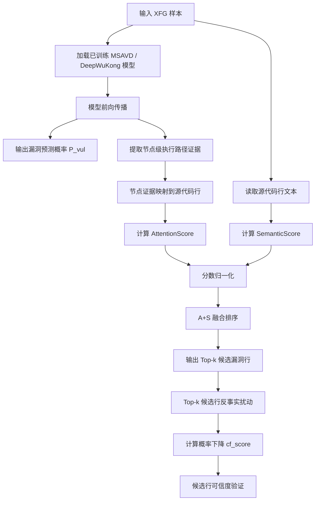
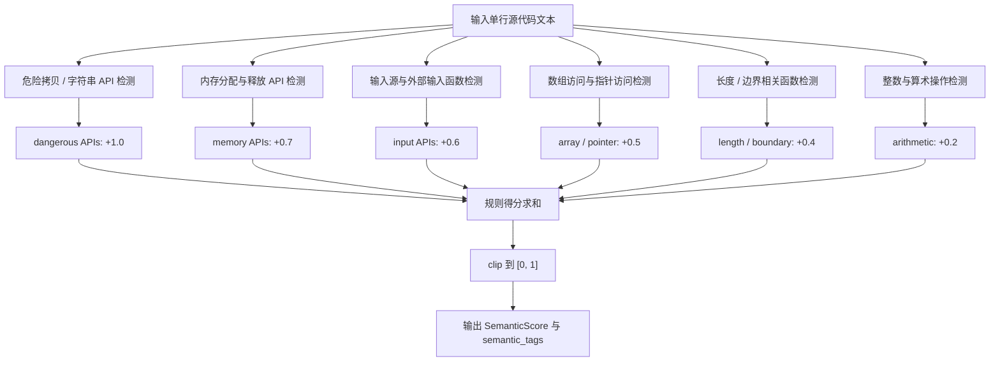
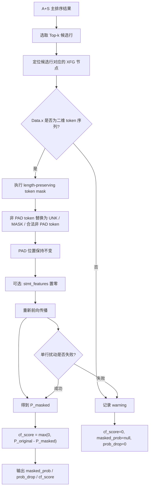

# 论文流程图 Mermaid 草稿

本文档整理第4章和第5章可使用的 Mermaid 图示。图中仅描述已实现和已验证的方法流程，不扩展未完成实验，也不夸大反事实模块作用。

## 图1 方法总体框架

**图1 基于语义增强执行路径证据的漏洞行级定位与可解释方法总体框架**

图注：输入样本首先经过已训练漏洞检测模型获得样本级漏洞概率，并提取节点级执行路径证据。随后，节点证据映射为行级 Attention Score，代码文本被用于计算 Semantic Score。本文主方法采用 A+S 融合分数生成 Top-k 候选漏洞行；反事实扰动仅用于候选行可信度验证和 Top-5 召回增强，不作为最终主排序模块。

## 图2 语义风险分数计算流程

**图2 语义风险分数计算流程**

图注：Semantic Score 基于代码行文本中的安全风险语义规则计算。不同风险类型对应不同权重，最终得分裁剪到 \([0,1]\) 区间，以避免多规则命中导致分数无界增长。该分数用于补充模型内部注意力证据，使候选漏洞行排序更符合安全审计中的危险语句判断。

## 图3 反事实验证流程

**图3 轻量反事实扰动验证流程**

图注：反事实验证仅对主排序得到的 Top-k 候选行执行轻量扰动。为避免 RNN 编码器接收到长度为 0 的输入，本文采用 token-level length-preserving mask：原始 PAD 位置保持不变，非 PAD token 替换为 UNK、MASK 或合法非 PAD token。若候选行无法安全扰动或单行扰动失败，则记录 warning，并将该行反事实分数置为 0。该模块用于验证候选行对模型预测概率的影响，而非替代 A+S 主排序方法。