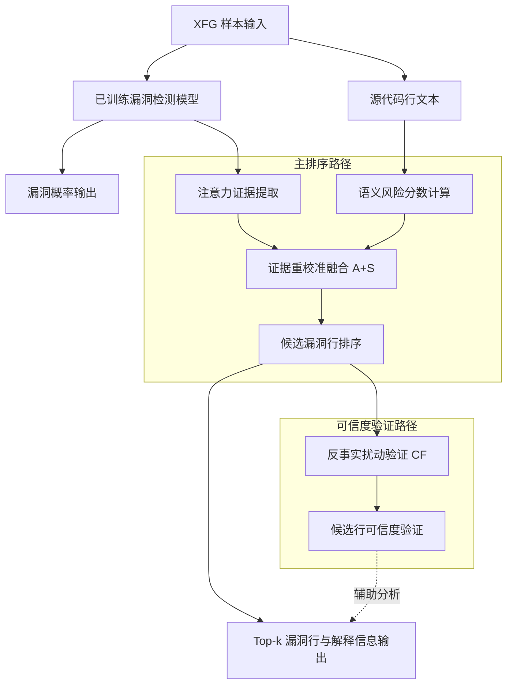
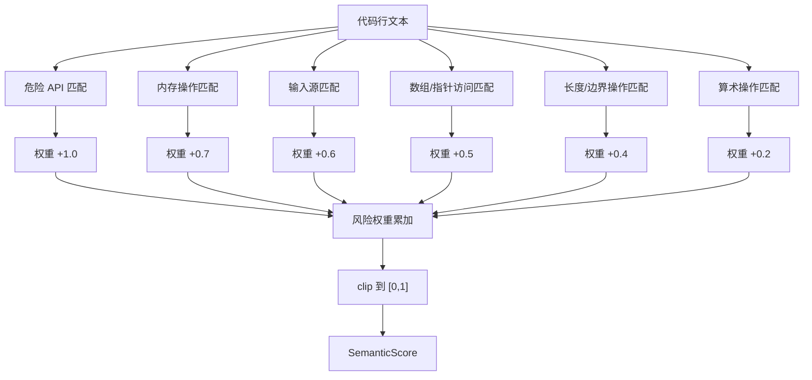
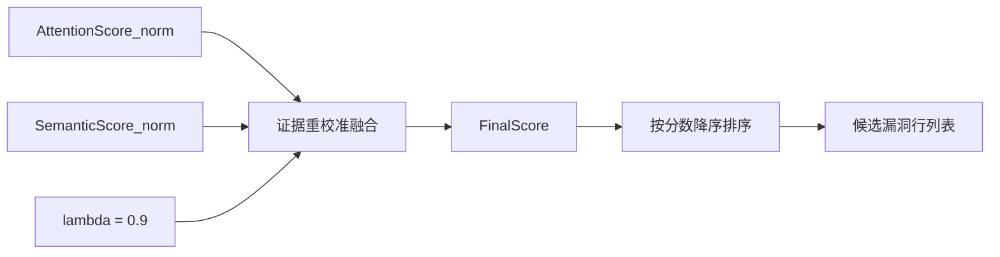
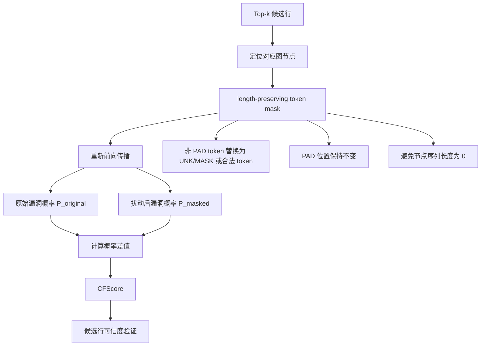
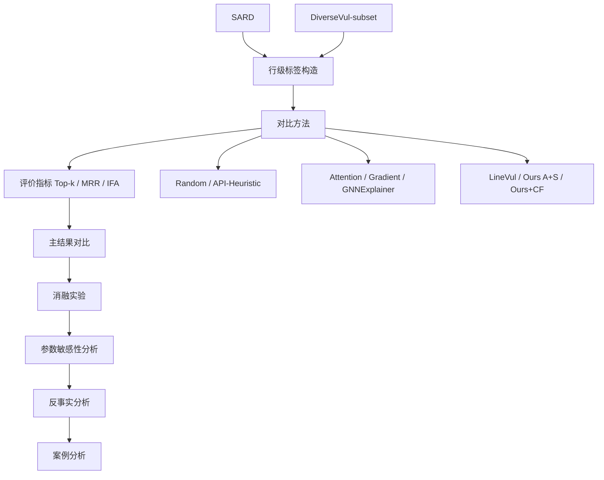

# 论文插图 Mermaid 源码

本文档整理小论文正文中使用的 5 张流程图。所有图示均采用黑白友好的 Mermaid 流程图表达，图中文字与正文术语保持一致。图示仅描述已实现的方法流程与已给出的实验设计，不新增实验结果，也不改变本文结论边界：A+S 是最终主排序方法，CF 作为可信度验证和 Top-5 召回增强模块。

## 图1 总体方法框架图

**图1 基于语义风险增强证据重校准的漏洞行级定位总体框架**

图注：该图展示本文方法从 XFG 样本输入到漏洞行级解释输出的整体流程。已训练漏洞检测模型首先输出样本级漏洞概率，并提供节点或行级注意力证据；随后，代码行文本被用于计算语义风险分数。本文以注意力证据与语义风险融合后的 A+S 分数作为主排序依据，反事实扰动模块仅对候选结果进行可信度验证，并辅助提升 Top-5 候选召回。

## 图2 语义风险分数计算流程图

**图2 语义风险分数计算流程**

图注：该图给出语义风险分数的规则化计算过程。方法从单行代码文本中识别危险 API、内存操作、外部输入、数组与指针访问、长度边界操作和算术操作，并按照预设权重累加风险分数。为避免多类规则同时命中导致分数无界增长，最终将分数裁剪到 $[0,1]$ 区间，用作 A+S 主排序中的语义风险证据。

## 图3 证据重校准融合示意图

**图3 注意力证据与语义风险分数融合示意图**

融合公式为：

$$
S(v_i) = (1-\lambda)\hat{A}(v_i) + \lambda\hat{R}(v_i)
$$

其中，$\hat{A}(v_i)$ 表示归一化后的注意力证据分数，$\hat{R}(v_i)$ 表示归一化后的语义风险分数，$\lambda$ 为语义风险权重。本文最终设置 $\lambda=0.9$。

图注：该图说明本文主排序分数的构成方式。AttentionScore_norm 提供模型内部执行路径证据，SemanticScore_norm 提供安全语义先验，两者经过归一化后按线性公式融合得到 FinalScore。候选漏洞行按照 FinalScore 降序排列。该融合模块对应本文最终主方法 A+S。

## 图4 反事实扰动验证流程图

**图4 反事实扰动可信度验证流程**

反事实分数定义为：

$$
C(v_i)=\max\left(0, P_{\mathrm{vul}}(G)-P_{\mathrm{vul}}(G_{\setminus i})\right)
$$

图注：该图展示反事实扰动模块的可信度验证流程。方法仅对 Top-k 候选行定位其对应图节点，并采用 token-level length-preserving mask 进行局部扰动，避免将节点 token 序列全部置为 PAD 而导致模型编码失败。若扰动后漏洞概率下降较多，则说明该候选行对模型预测具有较强影响。CFScore 主要用于解释可信度验证和 Top-5 召回增强，不作为最终主排序分数。

## 图5 实验设计流程图

**图5 实验设计与评价流程**

图注：该图概括本文实验设计与评价流程。实验在 SARD 和 DiverseVul-subset 两个数据集上构造行级标签，并与随机排序、启发式规则、模型解释方法、梯度归因方法、图解释方法和行级检测方法进行比较。评价指标包括 Top-k Accuracy、MRR 和 IFA。实验分析依次包括主结果对比、消融实验、参数敏感性分析、反事实扰动分析和案例分析，用于说明 A+S 主方法及 CF 辅助验证模块的作用边界。
