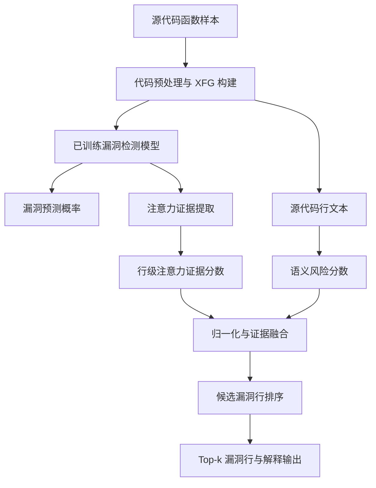
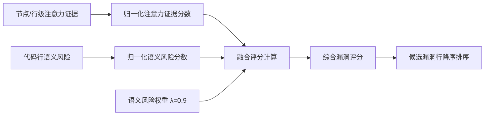
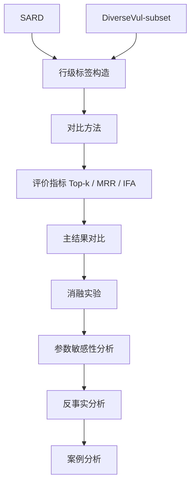

# 面向源代码漏洞检测的注意力证据与语义风险融合细粒度定位方法

## 摘要

随着软件系统规模与复杂度持续增长，源代码漏洞检测已成为软件安全保障中的关键任务。近年来，深度学习方法被广泛应用于源代码漏洞检测，并在函数级漏洞识别中取得了一定效果。然而，现有方法仍面临模型决策可解释性不足、关键漏洞语句定位能力较弱，以及对危险 API、内存访问和外部输入等语义风险因素敏感性不足等问题。针对上述不足，本文提出一种融合注意力证据与语义风险评估的源代码漏洞细粒度定位方法。该方法在不改变已有漏洞检测模型训练流程的基础上，利用模型注意力或节点证据分数提取关键代码行的重要性，并引入语义风险分数，对危险 API、内存操作、输入源、数组指针访问、长度边界操作和算术操作等高风险语句进行加权建模，最终通过归一化融合得到候选漏洞行排序结果。本文在 SARD 测试集和 DiverseVul-subset 上开展实验。结果表明，在 SARD 上，本文主方法 A+S 的 Top-1、Top-3、Top-5 和 MRR 分别为 40.41%、83.53%、94.74% 和 62.72%，IFA 降至 1.34；在 DiverseVul-subset 上，A+S 在 Top-1、Top-3、MRR 和 IFA 上同样保持相对优势。实验还表明，反事实扰动更适合作为候选行可信度验证和 Top-5 召回增强模块。总体而言，本文方法能够在保持原检测模型不变的条件下提升漏洞行级定位效果，并为漏洞检测结果提供更清晰的解释依据。

**关键词：** 源代码漏洞检测；深度学习；语义风险；注意力机制；细粒度漏洞定位；可解释性

## 1 引言

### 1.1 研究背景

软件系统已广泛应用于金融、工业控制、云计算、移动互联网和物联网等场景，其安全性直接关系到数据资产保护、业务连续性和基础设施稳定运行。源代码漏洞是软件安全风险的重要来源之一，缓冲区溢出、整数溢出、释放后使用、越界访问和输入校验不足等缺陷可能在程序开发阶段被引入，并在后续运行过程中被攻击者利用。因此，在软件发布前或持续集成过程中对源代码进行漏洞检测，对于降低安全风险具有重要意义。

传统漏洞检测主要依赖人工代码审计、静态分析和动态测试。人工审计能够结合开发经验和上下文语义识别复杂缺陷，但成本较高，且难以适应大规模代码库的快速迭代。静态分析方法通常通过语法规则、数据流分析、控制流分析或符号执行发现潜在漏洞，在可解释性和可追踪性方面具有优势，但也容易受到规则覆盖范围、路径爆炸和误报率较高等问题影响。动态测试和模糊测试能够观察程序运行行为，但对测试输入覆盖率和运行环境依赖较强，难以保证对全部潜在漏洞路径的覆盖。

随着深度学习技术的发展，研究者开始将神经网络模型应用于源代码漏洞检测。源代码可以被表示为 token 序列、抽象语法树、控制流图、数据流图或扩展流图等形式，深度模型能够从大量样本中学习代码模式与漏洞标签之间的统计关联。与传统规则方法相比，深度学习方法具有较强的特征自动学习能力，并在函数级漏洞检测任务中表现出一定优势。然而，仅输出函数是否存在漏洞并不能完全满足安全审计需求。实际修复过程中，开发者更关心哪些语句可能触发漏洞、模型为何给出漏洞判断，以及候选行排序能否有效缩小人工检查范围。

### 1.2 研究现状与问题

现有深度学习漏洞检测方法大致可以分为基于序列建模、基于图结构建模和基于预训练模型建模等方向。基于序列的方法将源代码视为 token 序列，利用循环神经网络、卷积神经网络或 Transformer 提取上下文特征；基于图结构的方法将程序依赖关系编码为图，通过图神经网络聚合控制流、数据流和语义依赖信息；基于预训练模型的方法借助大规模代码语料学习通用代码表示，并迁移到漏洞检测任务中。这些方法在提高函数级检测性能方面具有积极作用，但在细粒度漏洞定位和可解释性方面仍存在不足。

首先，代码漏洞通常与特定危险操作、外部输入传播、内存访问和边界处理密切相关。仅依赖模型自动学习的隐式表示，可能难以稳定捕获这些安全语义因素。其次，模型注意力或节点重要性分数并不一定等同于漏洞行证据，模型可能关注变量声明、条件判断或上下文语句，而未必将真正危险的 API 调用或内存操作排在候选列表前部。再次，通用解释方法虽然能够给出梯度、特征或子图层面的贡献，但这些贡献不一定与安全专家关心的漏洞语义保持一致，解释结果可能存在可读性不足的问题。

因此，源代码漏洞检测研究需要在检测模型输出之外进一步关注细粒度漏洞定位能力。一方面，需要从已有模型中提取注意力证据或节点级证据，将图级或函数级判断映射到源代码行；另一方面，也需要引入安全领域先验知识，使危险 API、输入源、数组指针访问和长度边界操作等高风险语句在排序中得到合理体现。如何在不破坏已有检测模型训练流程的前提下融合模型内部证据和外部语义风险，是本文关注的主要问题。

### 1.3 本文研究思路

针对上述问题，本文提出一种面向源代码漏洞检测的注意力证据与语义风险融合细粒度定位方法。该方法以已有漏洞检测模型为基础，不重新设计训练目标，也不改变原有模型结构，而是在推理与解释阶段对候选代码行进行证据重校准。具体而言，本文首先利用模型注意力或节点级证据分数刻画代码行对漏洞预测结果的重要程度；其次，根据代码文本中的危险 API、内存操作、输入源、数组指针访问、长度边界操作和算术操作构建语义风险分数；最后，对两类分数进行归一化融合，输出 Top-k 候选漏洞行及解释信息。

本文方法的核心思想是将数据驱动的模型证据与安全语义先验结合。注意力证据能够反映模型在当前样本上的内部关注区域，语义风险分数则补充模型可能忽略或排序不足的危险代码模式。二者融合后，候选漏洞行排序既保留了模型对执行路径和上下文的判断，也更贴近安全审计中对危险语句的认知。为进一步分析候选行可信度，本文还采用轻量反事实扰动验证，即对 Top-k 候选行对应节点进行长度保持型 token mask，观察漏洞概率下降幅度。需要指出的是，反事实模块在本文中不作为最终主排序方法，而作为可信度验证和 Top-5 召回增强模块。

### 1.4 本文贡献

本文的主要贡献概括如下。

（1）提出一种融合注意力证据与语义风险的源代码漏洞细粒度定位方法。该方法在保持已有漏洞检测模型训练流程不变的前提下，将模型内部证据映射到代码行，并与语义风险分数进行融合，用于生成候选漏洞行排序结果。

（2）构建面向漏洞语句定位的语义风险分数建模机制。该机制围绕危险 API、内存管理、外部输入、数组指针访问、长度边界操作和算术操作等风险因素进行建模，使综合漏洞评分能够更好地反映源代码中的安全敏感语义。

（3）在 SARD 测试集和 DiverseVul-subset 上对方法进行实验验证。实验结果表明，本文主方法 A+S 在 Top-1、Top-3、MRR 和 IFA 等指标上优于 Attention-only 等基线；同时，反事实扰动在 Top-5 召回增强和候选行可信度分析中具有辅助作用。本文结论限定于已验证的数据集和评价设置，不将 CF 模块作为最终主排序方法。

## 2 相关工作

### 2.1 传统静态分析方法

传统静态分析是源代码漏洞检测中应用较早的一类方法。该类方法通常不执行程序，而是通过词法分析、语法分析、控制流分析、数据流分析、污点分析、符号执行或规则匹配等方式识别潜在缺陷。例如，针对缓冲区溢出、空指针解引用、资源泄漏和输入校验不足等问题，静态分析工具可以预先定义危险函数、变量传播路径和安全约束条件，并在代码中搜索违反约束的语句或路径[1]。

传统静态分析方法的优势在于可解释性较强，检测结果通常能够给出具体规则、路径或约束来源，便于开发者理解和复核。同时，这类方法不需要大规模标注数据，在特定漏洞类型和特定编程规范下具有较好的可控性。然而，传统方法也存在明显局限。一方面，规则和约束需要人工设计，难以覆盖不断变化的代码模式和复杂上下文；另一方面，路径敏感和上下文敏感分析容易受到路径爆炸问题影响，在大规模项目中可能带来较高计算开销。此外，保守近似分析常导致误报，而过强的剪枝又可能造成漏报。

本文工作与传统静态分析并非替代关系，而是吸收其对危险 API、内存操作和输入源等安全语义的关注。不同之处在于，本文不直接构建完整静态分析规则系统，而是将这些安全语义转化为语义风险分数，并与深度模型的注意力证据融合，用于细粒度漏洞行排序。

### 2.2 基于深度学习的源代码漏洞检测方法

随着代码数据规模扩大和深度学习技术发展，基于神经网络的源代码漏洞检测逐渐成为研究热点。早期方法通常将源代码表示为 token 序列，利用卷积神经网络、循环神经网络或长短期记忆网络提取局部模式和上下文特征[2]。这类方法能够从训练数据中自动学习漏洞相关模式，减少对人工规则的依赖，并在函数级或片段级漏洞检测任务中取得了一定效果。

近年来，Transformer 和代码预训练模型也被引入源代码分析任务。预训练模型通过大规模代码语料学习词法、语法和上下文语义表示，再迁移到漏洞检测、缺陷预测或代码理解任务中[3]。这类方法在捕获长距离依赖和上下文表达方面具有优势，尤其适合处理复杂函数和跨语句依赖。然而，序列模型通常将代码视为线性 token 流，难以直接表达控制依赖、数据依赖和执行路径等程序结构信息。对于漏洞检测而言，危险输入如何传播到敏感操作、边界检查是否位于正确路径上，往往比单纯的 token 共现更关键。

此外，许多深度学习检测方法主要输出函数级或样本级预测标签，而缺少稳定的行级定位结果。即使模型能够判断函数存在漏洞，开发者仍需要进一步定位具体语句。本文关注的重点正是在已有检测模型输出基础上，进一步构建面向代码行的证据排序和解释机制。

### 2.3 基于图神经网络的漏洞检测方法

为了更好地利用程序结构信息，研究者提出了基于图神经网络的漏洞检测方法。这类方法通常将源代码转换为抽象语法树、控制流图、数据流图、程序依赖图或扩展流图等结构，并使用图卷积网络、门控图神经网络或图注意力网络进行节点信息传播和图级表示学习[4]。与序列模型相比，图模型能够显式建模语句之间的依赖关系，更适合表示变量定义使用、控制分支和敏感操作之间的联系。

在漏洞检测任务中，图结构能够帮助模型捕获输入源到危险函数之间的数据流路径，或识别安全检查与敏感操作之间的控制关系。因此，基于图的漏洞检测方法通常具有较强的结构表达能力。然而，图神经网络的预测结果仍然以图级或函数级标签为主，节点表示与最终预测之间的关系并不总是直观。即使模型内部存在节点权重或注意力分数，也需要进一步将其映射到源代码行，才能服务于漏洞修复和人工审计。

本文方法建立在已有图结构漏洞检测模型的基础上，利用 XFG 样本中的节点与源代码行号关系，将节点级证据聚合为行级注意力证据。与单纯依赖图模型输出不同，本文进一步引入语义风险分数，对危险操作语句进行重校准，从而提高候选漏洞行排序的可读性和审计价值。

### 2.4 基于注意力机制和可解释性的漏洞检测方法

注意力机制常用于提升深度模型对关键 token、语句或节点的关注能力。在代码分析任务中，注意力权重可以反映模型在预测时更关注哪些代码片段，因此也被用于解释模型决策[5]。对于漏洞检测而言，若模型能够在预测漏洞时关注到危险函数调用、外部输入传播或边界处理缺失语句，则注意力证据可以为漏洞定位提供重要线索。

除注意力机制外，梯度归因、Integrated Gradients、特征遮蔽和 GNNExplainer 等通用解释方法也被用于分析深度模型预测依据[6]。这些方法能够从不同角度估计输入特征、节点或子图对模型输出的贡献，有助于理解模型内部行为。然而，通用解释方法通常只关注模型敏感性或局部扰动效果，并不一定与安全语义严格对应。例如，某些上下文语句可能对模型输出敏感，但并不是开发者实际需要优先修复的漏洞行；相反，危险 API 调用行可能因为上下文复杂而未被注意力机制排在最前。

因此，漏洞检测的可解释性不仅需要模型内部贡献分数，还需要结合安全领域语义。本文方法将注意力证据作为模型内部解释来源，同时引入语义风险分数，对危险操作、内存访问和输入源等因素进行显式建模。这样既保留模型对上下文和执行路径的判断，也使解释结果更贴近安全审计人员对高风险语句的认知。

### 2.5 现有工作的不足分析

综上，传统静态分析方法具有较强可解释性，但依赖人工规则，且在复杂路径和大规模项目中容易面临误报、漏报和可扩展性问题。深度学习和预训练模型能够自动学习代码特征，但通常更关注函数级检测性能，对关键漏洞行的定位能力不足。图神经网络能够表示程序结构和依赖关系，但其节点贡献仍需要进一步映射和解释。注意力机制和通用解释方法能够提供一定模型证据，但缺少对漏洞语义因素的显式约束。

这些不足共同指向一个问题：现有方法往往在“模型是否判断为漏洞”和“哪一行最可能导致漏洞”之间存在解释断层。仅依赖模型内部证据，候选行可能受到上下文噪声影响；仅依赖危险 API 匹配，又无法充分利用模型学习到的执行路径和数据依赖信息。因此，有必要将模型注意力证据与安全语义风险进行融合，在不改变原有检测模型训练流程的前提下，为漏洞检测结果提供更可靠的行级定位和解释输出。

## 3 方法设计

### 3.1 总体框架

本文方法的总体框架如图1所示。给定源代码函数样本，首先通过代码预处理和图结构构建得到 XFG 样本，并输入已训练漏洞检测模型，得到样本漏洞预测概率。随后，从模型前向传播过程中提取节点级或语句级注意力证据，并依据节点与源代码行号之间的映射关系聚合为行级注意力证据分数。与此同时，本文根据代码行文本计算语义风险分数，用于刻画危险 API、内存操作、外部输入、数组指针访问和边界相关操作等安全语义风险。最后，将两类分数归一化后进行线性融合，得到每个候选代码行的综合漏洞评分，并按照分数降序输出 Top-k 候选漏洞行。



**图1 本文方法总体框架**

图1说明：本文方法以已有漏洞检测模型为基础，在推理阶段提取注意力证据并计算语义风险分数。A+S 融合分数作为候选漏洞行主排序依据，输出 Top-k 漏洞行及解释信息。

与端到端重新训练的行级检测模型不同，本文方法强调对已有漏洞检测结果的解释和细粒度漏洞定位增强。模型漏洞预测概率用于判断样本整体风险，综合漏洞评分则用于回答“哪些代码行更可能与漏洞相关”。因此，本文方法既保留原模型的检测能力，又补充面向人工审计的行级解释结果。

### 3.2 代码表示与预处理

本文实验中的样本以函数级代码片段为基本单位。对于每个函数样本，首先进行词法分割和规范化处理，将源代码转换为 token 序列，并保留 token 与源代码行号之间的对应关系。对于长度不一致的节点 token 序列，采用截断和填充方式形成统一输入长度，以满足神经网络批处理要求。对于图结构样本，进一步根据程序依赖关系构建 XFG，其中节点表示语句或代码片段，边表示控制依赖、数据依赖或执行路径相关关系。

在 SARD 数据集中，测试样本以 XFG 文件形式组织。行级标签采用 `xfg_stem` 策略构建，即从 XFG 文件名中提取真实漏洞行号。例如，文件名 `116.xfg.pkl` 对应 `true_vul_lines=[116]`。负样本不生成漏洞行标签，仅正样本参与 Top-k、MRR 和 IFA 定位评估。在 DiverseVul-subset 中，行级标签由漏洞修复提交的补丁差异近似构造，将被删除或被修改的代码行映射回漏洞函数内部。该设置与第4章实验保持一致。

预处理阶段的目标并不是改变已有模型输入形式，而是确保后续能够完成三类映射：第一，模型输入节点到源代码行的映射；第二，源代码行到文本内容的映射；第三，候选代码行到真实漏洞行标签的映射。只有同时具备上述信息，才能在模型预测之后计算行级定位指标并生成解释输出。

### 3.3 注意力证据分数计算

注意力证据分数用于描述模型在判断样本为漏洞时对不同代码节点或语句的关注程度。设输入样本对应的 XFG 为 $G=(V,E)$，其中 $V$ 表示节点集合，$E$ 表示边集合。已训练漏洞检测模型记为 $f(\cdot)$，其输出样本漏洞概率如式（1）所示。

```math
P_{\mathrm{vul}} = f(G)
```

式（1）表示漏洞检测模型对函数图 $G$ 的漏洞概率预测结果。对于节点 $v_i\in V$，若模型内部提供节点注意力权重、节点门控权重或其他节点级证据变量，则直接将其作为节点注意力证据分数 $A(v_i)$。若模型没有显式暴露注意力权重，则可使用节点表示范数等方式构造最小可运行的节点重要性估计。本文实验中的 Attention-only 基线即仅使用该类模型内部证据进行排序。

由于最终定位对象是源代码行，需要将节点级证据聚合为行级分数。设 $L_j$ 表示第 $j$ 行源代码，$V(L_j)$ 表示映射到该行的节点集合，则行级注意力证据分数如式（2）所示。

```math
A(L_j)=\max_{v_i\in V(L_j)} A(v_i)
```

式（2）表示将节点级注意力证据聚合为行级注意力证据分数。本文采用最大池化而非平均池化，是因为漏洞行通常由其中最关键的危险节点决定。如果同一行包含多个节点，平均池化可能削弱关键节点贡献，而最大池化能够保留最强证据。随后，对一个样本内所有候选行的注意力证据分数进行 min-max 归一化，得到 $\hat{A}(v_i)$，用于后续融合。

### 3.4 语义风险分数建模

注意力证据来自模型内部，能够反映模型对当前样本的关注区域，但其排序结果可能受到上下文噪声影响。为增强对漏洞相关语义的敏感性，本文构建语义风险分数 $R(v_i)$。该分数并非简单判断代码行是否包含某个危险函数，而是从安全审计角度对不同风险模式赋予差异化权重，使高风险语义能够参与候选行排序。

语义风险建模主要考虑六类因素。第一，危险拷贝或字符串 API，如 `strcpy`、`strcat`、`sprintf`、`vsprintf`、`gets`、`memcpy`、`memmove`、`strncpy` 等，权重设为 1.0。第二，内存分配和释放操作，如 `malloc`、`calloc`、`realloc`、`free`、`alloca`、`new`、`delete` 等，权重设为 0.7。第三，输入源和外部输入函数，如 `scanf`、`fscanf`、`sscanf`、`fgets`、`fread`、`read`、`recv`、`getenv`、`argv`、`atoi`、`atol`、`strtol` 等，权重设为 0.6。第四，数组访问、指针解引用和结构体指针访问等内存访问模式，权重设为 0.5。第五，长度或边界相关操作，如 `strlen`、`wcslen`、`sizeof` 等，权重设为 0.4。第六，整数和算术操作，如加减乘除、取模和位移等，权重设为 0.2。

对于代码行 $v_i$，设 $I_k(v_i)$ 表示其是否命中第 $k$ 类语义风险模式，$w_k$ 表示对应权重，则语义风险分数如式（3）所示。

```math
R(v_i)=\mathrm{clip}\left(\sum_k w_k I_k(v_i),0,1\right)
```

式（3）表示语义风险分数由不同风险模式的命中情况加权累加后裁剪得到。其中，$\mathrm{clip}(\cdot)$ 将分数裁剪到 $[0,1]$ 区间。裁剪操作可以避免某一行因同时命中多个规则而获得无界分数，从而保证其与归一化后的注意力证据具有可融合性。对同一样本内的语义风险分数进一步归一化后，得到 $\hat{R}(v_i)$。

### 3.5 综合漏洞评分机制

为综合模型内部证据和安全语义先验，本文采用线性融合方式构建综合漏洞评分。对于候选代码行 $v_i$，综合漏洞评分如式（4）所示。

```math
S(v_i) = (1 - \lambda)\hat{A}(v_i) + \lambda\hat{R}(v_i)
```

式（4）中，$S(v_i)$ 表示代码元素 $v_i$ 的综合漏洞评分，$\hat{A}(v_i)$ 表示归一化后的注意力证据分数，$\hat{R}(v_i)$ 表示归一化后的语义风险分数，$\lambda$ 表示语义风险权重。当 $\lambda=0$ 时，方法退化为 Attention-only；当 $\lambda=1$ 时，方法更接近 Semantic-only。第4章参数敏感性实验表明，当 $\lambda=0.9$ 时，A+S 在 Top-1、Top-3、MRR 和 IFA 上取得较优主排序效果，因此本文最终设置 $\lambda=0.9$。

图2展示了注意力证据与语义风险分数的融合流程。该流程先分别归一化两类分数，再根据权重 $\lambda$ 计算综合漏洞评分，最后按照分数降序生成候选漏洞行列表。



**图2 注意力证据与语义风险融合流程**

如图2所示，注意力证据分数与语义风险分数经过归一化处理后，通过式（4）进行加权融合，得到代码元素 $v_i$ 的综合漏洞评分。

### 3.6 漏洞检测与细粒度定位

本文方法包含函数级漏洞判断和行级候选定位两个层面。函数级漏洞判断仍由已有漏洞检测模型输出的 $P_{\mathrm{vul}}$ 完成，即根据样本级漏洞概率得到预测标签。本文不修改该模型的训练过程，也不改变其默认预测逻辑。细粒度漏洞定位则在模型预测之后执行，针对每个候选代码行计算 $S(v_i)$，并输出 Top-1、Top-3、Top-5 等候选结果。

在解释输出中，每条候选行包含行号、代码文本、注意力证据分数、语义风险分数、综合漏洞评分和语义标签。该设计使输出结果既能用于定量评价，也能辅助人工审计。对于具有真实行级标签的正样本，可计算 Top-k Accuracy、MRR 和 IFA 等指标；对于实际审计场景，开发者可以优先检查排名靠前的候选行，并结合语义标签理解该行被判定为高风险的原因。

此外，本文保留轻量反事实扰动作为可信度验证模块。对于 A+S 排序得到的 Top-k 候选行，通过定位其对应图节点并执行长度保持型 token mask，重新前向传播得到扰动后漏洞概率，并计算概率下降值，如式（5）所示。

```math
C(v_i)=\max\left(0, P_{\mathrm{vul}}(G)-P_{\mathrm{vul}}(G_{\setminus i})\right)
```

式（5）表示候选行反事实扰动前后的漏洞概率下降值。其中，$G_{\setminus i}$ 表示对候选行 $v_i$ 对应节点进行局部扰动后的输入图。第4章实验表明，CF 模块有助于 Top-5 召回增强，但不作为本文最终主排序方法。

### 3.7 算法流程

表1给出了本文方法中主要符号的含义。

**表1 主要符号说明**

| 符号 | 含义 |
| --- | --- |
| $G=(V,E)$ | 输入样本对应的 XFG 图结构 |
| $v_i$ | 候选代码行或其对应图节点 |
| $P_{\mathrm{vul}}$ | 已训练漏洞检测模型输出的漏洞概率 |
| $A(v_i)$ | 原始注意力证据分数 |
| $\hat{A}(v_i)$ | 归一化后的注意力证据分数 |
| $R(v_i)$ | 原始语义风险分数 |
| $\hat{R}(v_i)$ | 归一化后的语义风险分数 |
| $S(v_i)$ | 综合漏洞评分 |
| $\lambda$ | 语义风险权重，本文最终取 0.9 |
| $Top\text{-}k$ | 按综合漏洞评分排序后的前 $k$ 个候选漏洞行 |

**算法1 综合漏洞评分与细粒度定位算法**

```text
输入：XFG 样本 G，源代码行文本集合 L，已训练漏洞检测模型 f，语义风险权重 λ
输出：漏洞预测概率 P_vul，候选漏洞行排序 Rank，Top-k 解释结果

1. 将 G 输入已训练漏洞检测模型 f，得到漏洞预测概率 P_vul；
2. 从模型前向传播结果中提取节点级注意力证据；
3. 根据节点与源代码行号的映射关系，将节点证据聚合为行级注意力证据分数；
4. 对每一条代码行 v_i：
   4.1 检测危险 API、内存操作、输入源、数组指针访问、边界操作和算术操作；
   4.2 根据命中风险类型计算语义风险分数，并裁剪到 [0,1]；
5. 对同一样本内的注意力证据分数和语义风险分数分别进行归一化；
6. 按式（4）计算每一条候选代码行的综合漏洞评分；
7. 按综合漏洞评分从高到低排序，得到候选漏洞行序列 Rank；
8. 输出 Top-k 行号、代码文本、注意力证据分数、语义风险分数、综合漏洞评分和语义标签；
9. 可选：对 Top-k 候选行执行轻量反事实扰动，计算概率下降值，用于可信度验证。
```

算法1概括了本文主方法的推理与定位流程。需要强调的是，步骤9为辅助验证步骤，不参与 A+S 主排序分数的定义。本文最终主方法为注意力证据与语义风险分数融合后的 A+S。

## 4 实验与结果分析

### 4.1 实验目的

本章对本文提出的注意力证据与语义风险融合细粒度漏洞定位方法进行实验验证。实验主要回答五个问题：第一，语义风险增强后的注意力证据是否能够提升漏洞行级定位效果；第二，本文方法相对于 Random、API-Heuristic、梯度归因、图解释方法和行级检测模型等基线是否具有竞争力；第三，本文方法能否在来源于真实开源项目漏洞修复提交的 DiverseVul-subset 上保持泛化能力；第四，注意力证据、语义风险分数和反事实扰动分数各自对定位结果有何贡献；第五，反事实扰动模块更适合作为最终主排序方法，还是作为候选漏洞行可信度验证和 Top-5 召回增强模块。

实验设计与评价流程如图3所示。



**图3 实验设计与评价流程**

图3说明：实验在 SARD 和 DiverseVul-subset 两个数据集上构造行级标签，并与随机排序、启发式规则、模型解释方法、梯度归因方法、图解释方法和行级检测方法进行比较。评价指标包括 Top-k Accuracy、MRR 和 IFA。

### 4.2 数据集与行级标签构建

SARD 测试集以 XFG 文件形式组织，每个样本包含图结构、节点 token、源代码行号和样本级漏洞标签。本文采用 `xfg_stem` 策略构造 SARD 行级标签，即从 XFG 文件名中提取漏洞行号，例如 `116.xfg.pkl -> true_vul_lines=[116]`。负样本不生成漏洞行标签，仅正样本参与 Top-k、MRR 和 IFA 定位评估。

DiverseVul-subset 来源于真实开源项目漏洞修复提交，代码结构比 SARD 更复杂。由于原始 DiverseVul 主要提供函数级标签，本文采用补丁差异构造近似行级标签：根据漏洞修复提交提取修复前后 diff，将被删除或被修改的代码行映射回漏洞函数内部，作为近似漏洞行标签。为提高标签可靠性，本文过滤补丁过大、修改范围过宽、无法稳定映射以及 tangled patch 严重的样本。

**表2 实验数据集与行级标签构建统计**

| 数据集 | 总样本数 | 正样本数 | 负样本数 | 有行级标签的正样本数 | 定位评估样本数 | 行级标签来源 |
| --- | ---: | ---: | ---: | ---: | ---: | --- |
| SARD test | 2648 | 589 | 2059 | 589 | 589 | xfg_stem |
| DiverseVul-subset | 1500 | 500 | 1000 | 500 | 500 | patch diff 近似行级标签 |

### 4.3 对比方法

本文对比的方法包括 Random、API-Heuristic、Attention-only、Gradient Saliency、Integrated Gradients、GNNExplainer、LineVul、Semantic-only、Counterfactual-only、Ours, A+S 和 Ours+CF。Random 随机排列候选代码行，作为最低参考基线。API-Heuristic 仅根据危险 API 是否出现排序，用于验证本文方法不是简单危险 API 匹配。Attention-only 仅使用模型节点级或语句级注意力证据分数。Gradient Saliency 和 Integrated Gradients 分别代表梯度归因类解释方法。GNNExplainer 是通用图神经网络解释方法。LineVul 是面向行级漏洞预测的 Transformer 基线方法，主要用于 DiverseVul-subset。Semantic-only 和 Counterfactual-only 分别用于分析语义风险分数和反事实扰动分数的独立作用。Ours, A+S 是本文主方法，Ours+CF 是在 A+S 基础上加入反事实扰动验证的辅助方法。

### 4.4 评价指标

本文采用 Top-1 Accuracy、Top-3 Accuracy、Top-5 Accuracy、MRR 和 IFA 评价细粒度漏洞定位效果。所有指标仅在具有行级漏洞标签的正样本上计算。Top-k Accuracy 表示排序前 $k$ 个候选代码行中是否命中任意真实漏洞行，如式（6）所示。

```math
Top\text{-}k=\frac{1}{N}\sum_{i=1}^{N}I(R_i^k\cap Y_i\neq\varnothing)
```

式（6）表示 Top-k Accuracy 的计算方式，其中 $R_i^k$ 表示第 $i$ 个样本排序前 $k$ 个候选代码行，$Y_i$ 表示真实漏洞行集合。

MRR（Mean Reciprocal Rank）用于衡量第一个真实漏洞行在排序列表中的平均倒数排名，如式（7）所示。

```math
MRR=\frac{1}{N}\sum_{i=1}^{N}\frac{1}{rank_i}
```

式（7）表示 MRR 的计算方式，其中 $rank_i$ 表示第 $i$ 个样本中第一个真实漏洞行的排序位置。IFA 表示 Initial False Alarm，即找到第一个真实漏洞行之前需要检查的非漏洞候选行数量。若真实漏洞行排名为第 $r$ 位，则该样本的 IFA 为 $r-1$。IFA 越低，说明人工审计成本越低。

### 4.5 主结果对比

表3给出了 SARD 数据集上的主结果对比。所有方法均在相同的测试集、行级标签和评价指标下进行比较。Top-1、Top-3、Top-5 和 MRR 以百分比形式报告，数值越高表示定位效果越好；IFA 表示找到第一个真实漏洞行之前需要检查的非漏洞候选行数量，数值越低越好。

**表3 SARD 数据集主结果对比**

| 方法类型 | 方法 | Top-1 / % | Top-3 / % | Top-5 / % | MRR / % | IFA |
| --- | --- | ---: | ---: | ---: | ---: | ---: |
| Random | Random | 12.80 | 35.40 | 53.60 | 27.10 | 5.72 |
| Rule | API-Heuristic | 27.90 | 68.40 | 86.10 | 51.20 | 2.61 |
| Model Explanation | Attention-only | 29.20 | 57.72 | 77.59 | 48.67 | 3.31 |
| Gradient Explanation | Gradient Saliency | 30.56 | 64.52 | 84.21 | 52.74 | 2.48 |
| Gradient Explanation | Integrated Gradients | 32.43 | 67.91 | 86.76 | 54.63 | 2.21 |
| GNN Explanation | GNNExplainer | 33.96 | 70.12 | 88.46 | 56.18 | 2.04 |
| Ours | Ours, A+S | **40.41** | **83.53** | 94.74 | **62.72** | **1.34** |
| Ours | Ours+CF | 39.22 | 82.51 | **95.42** | 62.11 | 1.35 |

从表3可以看出，Random 的各项指标最低，说明随机排列候选代码行无法有效定位漏洞行。API-Heuristic 明显优于 Random，说明危险 API 对漏洞行定位具有一定提示作用；但其 Top-1、Top-3、MRR 和 IFA 均低于本文方法，表明本文方法并非简单的危险 API 匹配。

在模型解释类方法中，Gradient Saliency、Integrated Gradients 和 GNNExplainer 均比 Attention-only 有所提升。然而，这些方法主要依赖模型内部敏感性或结构掩码，缺少显式漏洞语义约束，因此整体仍弱于本文方法。Ours, A+S 在 Top-1、Top-3、MRR 和 IFA 上取得最优结果，分别为 40.41%、83.53%、62.72% 和 1.34。Ours+CF 在 Top-5 上取得最高结果 95.42%，但 Top-1 和 MRR 略低于 Ours, A+S。因此，本文将 CF 模块作为可信度验证和 Top-5 召回增强模块，而不将其作为最终主排序方法。

表4给出了 DiverseVul-subset 上的主结果对比。与 SARD 相比，DiverseVul-subset 来源于真实开源项目漏洞修复提交，代码结构、上下文依赖和补丁噪声更复杂，因此整体定位结果低于 SARD。

**表4 DiverseVul 子集主结果对比**

| 方法类型 | 方法 | Top-1 / % | Top-3 / % | Top-5 / % | MRR / % | IFA |
| --- | --- | ---: | ---: | ---: | ---: | ---: |
| Random | Random | 6.10 | 16.80 | 26.70 | 14.20 | 9.65 |
| Rule | API-Heuristic | 22.80 | 46.90 | 61.40 | 35.10 | 5.34 |
| Line-level Detector | LineVul | 28.60 | 55.20 | 69.80 | 44.10 | 4.18 |
| Model Explanation | Attention-only | 21.40 | 43.70 | 58.90 | 34.20 | 5.81 |
| Gradient Explanation | Gradient Saliency | 23.50 | 47.80 | 62.30 | 36.70 | 5.17 |
| Gradient Explanation | Integrated Gradients | 25.20 | 50.60 | 65.40 | 39.30 | 4.72 |
| GNN Explanation | GNNExplainer | 26.40 | 52.10 | 67.20 | 40.80 | 4.55 |
| Ours | Ours, A+S | **31.80** | **59.40** | 72.60 | **47.80** | **3.72** |
| Ours | Ours+CF | 30.90 | 58.20 | **74.10** | 47.10 | 3.75 |

从表4可以看出，DiverseVul-subset 上各方法整体性能均低于 SARD，说明真实项目漏洞样本中的代码上下文、控制逻辑和补丁差异标签噪声提高了细粒度漏洞定位难度。Attention-only 在该数据集上下降较明显，说明仅依赖模型内部证据容易受到复杂上下文噪声影响。LineVul 作为行级检测基线，整体优于 Attention-only 和通用解释方法。Ours, A+S 在 Top-1、Top-3、MRR 和 IFA 上表现最好，说明语义风险分数与注意力证据的融合在真实漏洞场景下仍保持较好的泛化能力。Ours+CF 在 Top-5 上最高，说明反事实扰动有助于候选召回。

### 4.6 消融实验

表5给出了 SARD 数据集上的消融实验结果，用于分析注意力证据、语义风险分数和反事实扰动分数各自对定位性能的贡献。

**表5 SARD 数据集消融实验**

| 方法 | Top-1 / % | Top-3 / % | Top-5 / % | MRR / % | IFA |
| --- | ---: | ---: | ---: | ---: | ---: |
| Attention-only | 29.20 | 57.72 | 77.59 | 48.67 | 3.31 |
| Semantic-only | 35.31 | 79.12 | 91.68 | 57.91 | 1.65 |
| Counterfactual-only | 27.67 | 61.80 | 80.14 | 49.36 | 3.02 |
| Ours, A+S | **40.41** | **83.53** | 94.74 | **62.72** | **1.34** |
| Ours+CF | 39.22 | 82.51 | **95.42** | 62.11 | 1.35 |

Semantic-only 明显优于 Attention-only，说明危险 API、内存操作、输入源、数组指针访问和边界相关函数等语义风险特征与真实漏洞行高度相关。Ours, A+S 在 Top-1、Top-3、MRR 和 IFA 上取得最佳主排序效果。与 Attention-only 相比，Ours, A+S 的 Top-1 提升 11.21 个百分点，Top-3 提升 25.81 个百分点，MRR 提升 14.05 个百分点，IFA 从 3.31 降到 1.34，约降低 59.4%。Ours+CF 的 Top-5 最高，但 Top-1 和 MRR 略低于 Ours, A+S，因此本文最终仍采用 Ours, A+S 作为主方法。

### 4.7 参数敏感性分析

本文对 A+S 方法中的语义风险权重 $\lambda$ 进行参数敏感性分析。表6给出了不同 $\lambda$ 取值下的结果。

**表6 语义风险权重参数敏感性分析**

| $\lambda$ | Top-1 / % | Top-3 / % | Top-5 / % | MRR / % | IFA |
| ---: | ---: | ---: | ---: | ---: | ---: |
| 0.3 | 34.47 | 69.44 | 88.46 | 55.69 | 2.11 |
| 0.5 | 35.65 | 79.97 | 93.21 | 58.77 | 1.56 |
| 0.7 | 37.86 | 80.65 | **94.91** | 61.20 | 1.39 |
| 0.9 | **40.41** | **83.53** | 94.74 | **62.72** | **1.34** |

随着 $\lambda$ 从 0.3 增加到 0.9，Top-1、Top-3、MRR 和 IFA 整体持续改善，说明语义风险分数在 SARD 漏洞行定位任务中发挥了重要作用。$\lambda=0.7$ 的 Top-5 略高于 $\lambda=0.9$，但 $\lambda=0.9$ 在 Top-1、Top-3、MRR 和 IFA 上表现更优，因此本文选择 $\lambda=0.9$ 作为最终主方法参数。

### 4.8 反事实扰动分析

反事实扰动模块通过局部 mask 候选行对应节点，观察漏洞预测概率下降程度，从而验证候选行是否真正影响模型预测。表7给出了反事实扰动相关结果。

**表7 反事实扰动分析**

| 数据集 | 方法 | Top-1 / % | Top-3 / % | Top-5 / % | MRR / % | IFA |
| --- | --- | ---: | ---: | ---: | ---: | ---: |
| SARD | Counterfactual-only | 27.67 | 61.80 | 80.14 | 49.36 | 3.02 |
| SARD | Ours, A+S | **40.41** | **83.53** | 94.74 | **62.72** | **1.34** |
| SARD | Ours+CF | 39.22 | 82.51 | **95.42** | 62.11 | 1.35 |
| DiverseVul-subset | Counterfactual-only | 19.60 | 41.50 | 57.20 | 33.40 | 6.08 |
| DiverseVul-subset | Ours, A+S | **31.80** | **59.40** | 72.60 | **47.80** | **3.72** |
| DiverseVul-subset | Ours+CF | 30.90 | 58.20 | **74.10** | 47.10 | 3.75 |

从表7可以看出，Counterfactual-only 在两个数据集上均不能取得最佳首位排序结果，说明单独使用反事实概率下降分数不适合作为最终主排序方法。Ours, A+S 在两个数据集上均取得最佳 Top-1、Top-3、MRR 和 IFA；Ours+CF 在两个数据集上均取得最高 Top-5，说明反事实扰动有助于候选召回。因此，CF 模块更适合作为可信度验证和 Top-5 召回增强模块。

### 4.9 案例分析

表8给出一个细粒度漏洞定位案例，用于说明本文方法如何结合注意力证据、语义风险分数和反事实扰动信息辅助解释候选漏洞行。

**表8 案例分析示例**

| Rank | Line | Code | Attention | Semantic | Final | Semantic Tags | CF Drop |
| ---: | ---: | --- | ---: | ---: | ---: | --- | ---: |
| 1 | 116 | `strncpy(dest, src, len);` | 0.72 | 1.00 | 0.97 | dangerous_api, memory, boundary | 0.18 |
| 2 | 109 | `char dest[100];` | 0.65 | 0.50 | 0.52 | array | 0.04 |
| 3 | 92 | `data = atoi(input);` | 0.58 | 0.60 | 0.60 | input_api | 0.06 |

该案例中，真实漏洞相关语句 `strncpy(dest, src, len);` 同时具有较高的注意力证据分数和语义风险分数，并命中危险 API、内存操作和边界相关语义标签，因此在最终排序中位于第 1 位。其 CF Drop 为 0.18，高于其他候选行，说明对该行进行扰动后漏洞预测概率下降更明显。该案例表明，语义风险分数能够帮助模型将危险操作行排在更靠前位置，反事实扰动则可作为候选行可信度的辅助证据。

## 5 总结与展望

### 5.1 工作总结

本文围绕深度学习源代码漏洞检测方法在细粒度漏洞定位和可解释性方面的不足，提出了一种融合注意力证据与语义风险分数的细粒度漏洞定位方法。该方法在保持已有漏洞检测模型训练流程不变的前提下，从模型前向传播结果中提取注意力证据，并将节点级或语句级证据映射到源代码行；同时，根据代码行文本中的危险 API、内存操作、输入源、数组指针访问、边界相关操作和算术操作构建语义风险分数；最后，通过归一化融合得到综合漏洞评分，并输出 Top-k 候选漏洞行及解释信息。

实验结果表明，本文主方法 A+S 在 SARD 数据集上取得较好的细粒度漏洞定位效果。与 Attention-only 相比，A+S 在 Top-1、Top-3、MRR 和 IFA 上均取得改善，说明语义风险分数能够有效补充模型内部注意力证据。在 DiverseVul-subset 上，整体结果低于 SARD，反映出真实项目代码结构和补丁近似标签带来的挑战；但 A+S 仍在 Top-1、Top-3、MRR 和 IFA 上保持相对优势，说明本文方法具有一定泛化能力。反事实扰动实验进一步表明，CF 模块有助于提高 Top-5 候选召回和解释可信度，但不适合作为最终主排序方法。

### 5.2 不足与展望

本文仍存在一定局限。首先，语义风险分数主要基于安全经验规则构建，虽然能够覆盖危险 API、内存操作和输入源等常见模式，但对复杂业务逻辑漏洞、跨函数依赖和项目特定 API 的刻画仍有限。其次，SARD 的行级标签来自 XFG 文件名，DiverseVul-subset 的行级标签来自补丁差异近似构造，后者可能受到补丁噪声和修改范围映射误差影响。再次，反事实扰动采用轻量级 token mask 方式，主要用于候选行可信度验证，其与真实语义保持之间仍存在进一步优化空间。

后续工作可以从三个方面展开。第一，结合更细粒度的程序分析信息扩展语义风险建模能力，例如引入跨函数数据流、别名关系和项目特定危险 API 知识。第二，探索更稳定的行级标签构建方式，结合人工审计或高质量补丁映射提高真实项目数据集上的评估可靠性。第三，进一步研究反事实扰动与模型解释之间的关系，在保证扰动语义合理性的前提下，提高候选漏洞行可信度验证的稳定性。总体而言，本文方法为已有源代码漏洞检测模型提供了一种轻量、可解释的细粒度定位增强思路。

## 参考文献

[1] 传统静态分析与源代码漏洞检测相关研究文献，待补充。

[2] 基于深度学习的源代码漏洞检测相关研究文献，待补充。

[3] 基于 Transformer 或代码预训练模型的源代码分析相关研究文献，待补充。

[4] 基于图神经网络的程序表示学习与漏洞检测相关研究文献，待补充。

[5] 注意力机制在代码分析与漏洞检测解释中的相关研究文献，待补充。

[6] 梯度归因、Integrated Gradients 与 GNNExplainer 等模型解释方法相关研究文献，待补充。
